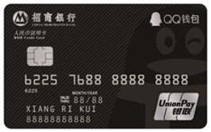

>身份证号、手机号和银行卡号互联网中用来认证用户、接收短信、注册账号等等，使用场景非常广泛。为了避免无效数据，经常要对这些数字进行校验，如果不清楚这些数字的组成和含义，就无法编写出严格的校验，最终导致一些原本无效的数据依然可以通过，本文总结了三种号码的组成和校验，对平时编写校验逻辑会有一定帮助。

# 银行卡号（Bank Card Number）



## 卡号组成

银行卡号一般是 16 位（信用卡/借记卡）或 19 位（借记卡）

```
  /--MII      
_/     /--IIN(BIN)
      /     /--个人账户标识，长度 6~12 位
_____/ ____/ _/--校验位
622576 8...8 8
```

**第 1 位**

卡号首位表示主要产业标识符([Major Industry Identifie, MII](https://en.wikipedia.org/wiki/ISO/IEC_7812))，由国际标准化组织于1989年首次发布，通过该值可以区分卡号的发行者所属行业，所有取值见下表：

|卡号首位|发行者类别|
|-|-|
|0|[ISO/TC 68](https://en.wikipedia.org/wiki/ISO/TC_68)及其他行业|
|1|航空|
|2|航空、金融和其他未来行业|
|3|旅游和娱乐业|
|4|银行业和金融业|
|5|银行业和金融业|
|6|商业和银行金融业|
|7|使用和其他未来行业|
|8|医疗、电信和其他未来行业|
|9|国家标准机构|

**第 1~6 位**

卡号前 6 位表示发行者标识代码([Issuer Identification Number, IIN](https://en.wikipedia.org/wiki/Payment_card_number#Issuer_identification_number_.28IIN.29))，也称位发卡行识别码(Bank Identification Number, BIN)，包含第 1 位产业标识符 MII。

|发布网|IIN 范围|长度|校验算法|
|-|-|-|-|
|中国银联(China UnionPay)|62|16-19|Luhn algorithm|
|美国运通(American Express)|34,37|15|Luhn algorithm|
|Visa|4|13,16,19|Luhn algorithm|
|[more...](https://en.wikipedia.org/wiki/Payment_card_number#Issuer_identification_number_.28IIN.29)|.|.|.|
    
**第 7~X 位(长度可变，6~12位)**
除去卡号前 6 位和最后 1 位，中间数字表示个人账号标识，中间数字由发行机构自定义，由6-12位数字组成。每个银行的个人账号标识规则有所不同。有的银行在这部分内容中会包含分行、支行、储蓄网点等代码信息。有得银行可能就没有这么详细，会使用自然流水顺序码。

**最后 1 位**

最后 1 位表示校验位，由卡号前面的数字(不含最后 1 位)采用[Luhn算法](https://en.wikipedia.org/wiki/Luhn_algorithm)计算得出。

## 卡号校验

卡号的最后一位都是通过[Luhn算法](https://en.wikipedia.org/wiki/Luhn_algorithm)进行计算或校验，校验算法描述如下：

```javascript
/**
 * luhn check algorightm
 * @param {string} input - card NO
 * @returns {boolean} return true if input is valid, otherwise return false
 */
function luhnCheck(input) {
    var sum = 0
    for (var i = input.length - 1; i >= 0; --i) {
        var digit = parseInt(input[i], 10) * (i % 2 === 0 ? 2 : 1)
        if (digit <= 9) {
            sum += digit   
        } else {
            sum += (digit % 10 + parseInt(digit / 10, 10))
        }
    }
    return sum % 10 === 0
}
```

上面的校验算法仅校验卡号是否符合规则，实际应用还需要根据具体场景校验卡号的开头位和长度等，下面是一个银联卡号的校验函数：
```javascript
// return true if input is a valid bank card no, otherwise return false
function checkBankCardNo (input) {
    return /^62(\d{14}|\d{17})$/.test(input) && luhnCheck(input)
}
```

上面两段代码的在线示例：<https://runkit.com/whinc/luhn-check-algorithm>

参考：

* [Payment card number | wikipedia](https://en.wikipedia.org/wiki/Payment_card_number)
* [Luhn algorithm | wikipedia](https://en.wikipedia.org/wiki/Luhn_algorithm)
* [银行卡号各个数字是什么含义？ | 知乎](https://www.zhihu.com/question/20880750#answer-4771564)

# 身份证号（ID Card Number）

## 卡号组成

身份证号码一共有18位数字，各位数字代表的含义：
1. 第1、2位数字表示：所在省份的代码； 
2. 第3、4位数字表示：所在城市的代码； 
3. 第5、6位数字表示：所在区县的代码；
4. 第7~14位数字表示：出生年、月、日； 
5. 第15、16位数字表示：所在地的派出所的代码；
6. 第17位数字表示性别：奇数表示男性，偶数表示女性； 
7. 第18位数字是校检码：根据前面十七位数字码，按照ISO 7064:1983.MOD 11-2校验码计算出来的校验码，取值 0~11（11用 X 表示）。


## 省市区县识别

我们把身份证前六位地址码码，按ABCDEF表示。

AB 表示身份证主人所在的省(直辖市，自治区，特别行政区)代码。

11-15 京 津 冀 晋 蒙
21-23 辽 吉 黑
31-37 沪 苏 浙 皖 闽 赣 鲁
41-46 豫 鄂 湘 粤 桂 琼
50-54 渝 川 贵 云 藏
61-65 陕 甘 青 宁 新
81-82 港 澳

CD 表示地区代码（地级），省的城市代码从省会开始排，只有地级城市有独立的城市代码，而县级市没有。

4201 湖北省武汉市
4202 湖北省黄石市

EF 表示为县区代码（市辖区、郊区、郊县、县级市）。

420101 武汉市市辖区
420102 武汉市江岸区

## 卡号校验

身份证号最后一位使用ISO 7064:1983.MOD 11-2校验码计算，计算公式：
```
c = ∑(ai × Wi)(mod 11)
```
公式中：
`i`:表示号码字符从右至左（包括校验码在内）的位置序号，从 1 开始；
`ai`:表示第`i`位置上的号码字符值；
`Wi`:示第`i`位置上的加权因子，其数值依据公式`Wi=2^（i-1）(mod 11)`计算得出。 
>计算`c`时不包含最后校验位的计算值， 即`a1 x w1`不计算在内。

计算出`c`后，根据下表查出对应的校验码（通过`(12-R) % 11, R=0..10`公式计算得出）：

|0|1|2|3|4|5|6|7|8|9|10|
|-|-|-|-|-|-|-|-|-|-|-|
|1|0|X|9|8|7|6|5|4|3|2|

根据身份证号码检验位，判断身份证号是否有效：

```javascript
// written by whincwu
function checkIDCardNo(no)  {
    var sum = 0,
        W = [7, 9, 10, 5, 8, 4, 2, 1, 6, 3, 7, 9, 10, 5, 8, 4, 2, 1];
        T = '10X97865432';
    for (var i = 0; i < no.length - 1; ++i) {
        sum += no[i] * W[i];
    }
    return T[sum % 11] === no[i];
}

checkIDCardNo('34052419800101001X');    // true
```

参考：

* [身份证校验码计算公式：ISO 7064:1983.MOD 11-2](http://whitewin.ahcme.cn/content.aspx?id=797655118316)


# 手机号（Phone Number）

## 号码组成

中国使用的手机号码为11位，使用 MDN 结构`CC + MAC + H0 H1 H2 H3 + ABCD`其中：

`CC`：国家码，中国使用86。
`MAC`：移动接入码，例如 133。
`H0H1H2H3`：HLR 识别码，由运营商统一分配。
`ABCD`：移动用户号，由各 HLR 自行分配。

## 手机开头号码含义

`10`开头：电信服务号。例如10010中国联通服务中心，10050中国铁通服务中心，10060中国网通服务中心，10070中国卫通服务中心，10086中国移动服务中心等。
`11`开头：特种服务号。如110匪警，111电信内部测试，112报修，113、115国内人工长途挂号，114查号台，116国内人工长途查询，117报时，119火警等。
`12`开头：特殊民用号。如120（医院），121（天气预报），122交通事故告警，12312保护知识产权举报中心，12315消费投诉热线，12319城建服务，12348法律咨询，12358价格举报中心，12365质量监督，12366纳税服务，12369环境保护投诉。
`13`开头：用于 2G 通信号码段。 130~133 归属中国联通，134~139 归属中国移动
`15`开头：用于 3G 通信号码段。153 归属中国联通，158~159 归属中国移动。
`16`开头：声讯类号码。如160中国电信工人信息服务接入码，166务，167吉通计算机互联网业务接入码，168声讯服务，中国电信公众多媒体网接入码等。
`17`开头：长途电话服务号。如170国内长途全自动话费查询台，173国内立接制长途半自动挂号台，176国内长途半自动查询台，177国内长途半自动班长台，179 IP语音服务接入码等。
`18`开头：用于 3G 通信号码段、部分服务号。如180邮政服务，184邮政编码查询接入码，185国家邮政局电话信息服务接入码，186移动服务中心，188固定电话交费台，189中国电信业务受理特服台等。
`19`开头：寻呼接入。191联通无线电人工寻呼接入码，192联通无线电自动寻呼接入码等等。
`20/30`开头：电话卡服务。
`8/9`开头：电信及民用服务号码。如 95501深圳发展银行，95502永安财产保险，95505天安保险，95508广州发展银行

参考

* [手机号码 | 搜狗百科](http://baike.sogou.com/v23265397.htm?fromTitle=%E6%89%8B%E6%9C%BA%E5%8F%B7%E7%A0%81)
* [手机、电话号码编码组成及号段分配](http://www.360doc.com/content/12/0620/01/5733130_219320179.shtml)
