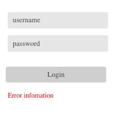
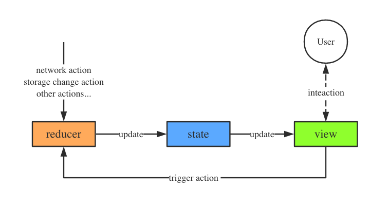

## redux 是什么？

redux 是一个前端状态管理库。

为什么要搞个状态管理库来增加复杂度和学习成本呢？这样讲没错，简单的项目用 redux 就是折腾自己，我也不建议你用，但是大一点项目，尤其是多人协作时，就完全是另一回事了。

随着 JavaScript 单页应用开发日趋复杂，JavaScript 需要管理比任何时候都要多的 state(状态)。 这些 state 可能包括服务器响应、缓存数据、本地生成尚未持久化到服务器的数据，也包括 UI 状态，如激活的路由，被选中的标签，是否显示加载动效或者分页器等等。

管理不断变化的 state 非常困难。如果一个 model 的变化会引起另一个 model 变化，那么当 view 变化时，就可能引起对应 model 以及另一个 model 的变化，依次地，可能会引起另一个 view 的变化。直至你搞不清楚到底发生了什么。state 在什么时候？由于什么原因？如何变化？已然不受控制。 当系统变得错综复杂的时候，想重现问题或者添加新功能就会变得举步维艰。

举个例子，一个登录页面有账号输入框、密码输入框和登录按钮，现在要实现，输入的密码符合条件时，登录按钮高亮可点击，不符合条件时，登录按钮置灰不可点击，同时显示提示信息。这里需要三个变量来表示页面 state：password（密码）、canLogin(按钮是否可用)和 hasInfo(提示信息是否显示)。



为了实现这个功能，你需要监听输入框的变化事件，检测到变化时，就判断 password 是否符合条件，然后更新 canLogin 和 hasInfo 状态。

```javascript
password.on('change', () => {
  canLogin = ...
  hasInfo = ...
})
```

很多人觉得这个很简单啊，OK，这里逻辑再加上账户输入框的变化时，也更新按钮和提示状态呢？如果再加上账户输入时，要实时后台校验是否已注册，然后更新按钮和提示状态呢？如果这个页面再复杂一点呢？

```javascript
username.on('change', () => {
  canLogin = ...
  hasInfo = ...
})

function login () {
  setTimeout(() => {
    canLogin = ...
    hasInfo = ...
  }, 1000)
}

// more code may modify state 'canLogin' and 'hasInfo' ...
```
这个时候，当你发现按钮无法点击，需要排查原因时，你很难快速找出 canLogin 是由于哪个因素引起的。

这里的复杂性很大程度上来自于，我们总是将两个难以理清的概念混淆在一起：**变化**和**异步**。通过限制更新发生的时间和方式，**Redux 试图让 state 的变化变得可预测**。这些限制条件反映在 Redux 的三大原则中（后面提到）。

说了这么多，可能还是不知道 redux 是什么，但至少知道 redux 似乎可以解决上面这个状态管理的问题。抽象的东西结合实践比较容易理解，接下来看下 redux 的核心概念和具体使用方法。


## redux 核心概念

redux 本身非常简单，它只有三个核心概念：**state**、**action**和**reducer**，三者的关系如下图：



state 保存了应用程序当前状态，每当 state 发生变化时触发状态变化事件，事件的订阅者 View 拿到最新的 state 重新渲染 UI 以反映最新的 state 信息。

action 表示一个操作（请求修改 state 的操作），它是一个纯 JavaScript 对象，其包含了操作的类型、数据和元数据信息。用户与 View 进行交互，例如点击按钮、输入信息或页面跳转等，每个操作都会触发一个 action，网络请求、定时任务或系统其他异步事件，也会触发 action。所有 action 都会被送到一个称为 reducer 的处理函数。

reducer 是一个纯函数，其接受 state 和 action 作为输入，处理后返回一个新的 state，新的 state 会更新覆盖之前的 state 作为应用程序当前最新 state，并触发 state 变化事件。

上面就是 redux 核心思想：数据的流动是单向的，View 不直接操作 state，所有对 state 修改都通过发送 action 进行，action 统一由纯函数 reducer 进行处理，因此只有 reducer 能修改 state。redux 通过这些约束，让数据的变化变得可预测、可回溯。

下面结合一个 TODOs demo 看看 redux 是如何工作的？

**state**

redux 的 state 是一个纯 JavaScript 对象，用于保存应用的状态数据。在 TODOs 应用中，state 保存了 todo 数组，每条 todo 都包含了内容和是否完成的标记，同时还有一个 visibilityFilter 标记用于过滤已完成的或未完成的 todos。
```javascript
{
  todos: [{
    text: 'Eat food',
    completed: true
  }, {
    text: 'Exercise',
    completed: false
  }],
  visibilityFilter: 'SHOW_COMPLETED'
}
```

**action**

要想更新 state 中的数据，你需要发起一个 action，action 是一个普通 JavaScript 对象，用来描述发生了什么。在 TODO 应用中，定义了三种 action：新增 todo、切换 todo 状态和修改 todo 过滤显示状态。

```javascript
// 新增一个 TODO
{ type: 'ADD_TODO', text: 'Go to swimming pool' } 

// 切换一个 TODO 的完成状态
{ type: 'TOGGLE_TODO', index: 1 }

// 显示所有状态（完成和未完成）的 TODO
{ type: 'SET_VISIBILITY_FILTER', filter: 'SHOW_ALL' }
```

>强制使用 action 来描述所有变化带来的好处是可以清晰地知道应用中到底发生了什么。如果一些东西改变了，就可以知道为什么变。

**reducer**

reducer 是一个纯函数，它接收两个参数 state 和 action，并返回**新的 state**，用伪代码描述：
```javascript
reducer = (state, action) => new_state
```

在 TODO 应用中，reducer 接收到 action 后，计算并返回新的 state。
```javascript
function todoApp(state = {}, action) {
  return {
    todos: todos(state.todos, action),
    visibilityFilter: visibilityFilter(state.visibilityFilter, action)
  };
}
```

```javascript
function todos(state = [], action) {
  switch (action.type) {
  case 'ADD_TODO':
    return state.concat([{ text: action.text, completed: false }]);
  case 'TOGGLE_TODO':
    return state.map((todo, index) =>
      action.index === index ?
        { text: todo.text, completed: !todo.completed } :
        todo
   )
  default:
    return state;
  }
}
```

```javascript
function visibilityFilter(state = 'SHOW_ALL', action) {
  if (action.type === 'SET_VISIBILITY_FILTER') {
    return action.filter;
  } else {
    return state;
  }
}
```

为了提高代码可维护性，对于每个字段的更新，可以抽取出粒度更小的 reducer 来完成，例如 `todoApp()`更新整个 state，内部又调用`todo()`更新`state.todos`字段，调用`visibilityFilter()`更新`state.visibilityFilter`字段。通过这种方式，我们可以根据不同的模块定义 reducer，每个reducer 只负责处理各自模块的 state 更新，最终将不同模块的 reducer 的处理结果合并成一个 reducer，下面是这个过程的示意图：
>redux 中习惯将 reducer 函数命名为为和被更新的 state 字段相同，这样直观且方便工具处理。


这差不多就是 Redux 思想的全部。几乎没有介绍到 Redux 的 API，Redux 90% 的是思想，这部分都是纯 JavaScript 代码。

## Redux API

上面一节已经将 redux 的核心思想介绍完了，唯一缺失的部分是，如何连接各个部分：View 如何发送 action、action 如何传递给 reducer 处理，更新 state 后如何通知 View 更新。这部分可以基于事件的发布-订阅完成，实际上 redux 的 API 也确实是这样实现的。

Redux 的 API 主要是提供了 Store，它的作用就是将这几个概念串联起来。Store 有以下职责：
* 内部维持应用的 state 和 reducer；
* 提供`getState()`方法获取 state；
* 提供`dispatch(action)`方法更新 state；
* 通过`subscribe(listener)`注册监听器;

```javascript
import { createStore } from 'redux'
// 应用的初始状态
const initialState = {
  todos: [],
  visibilityFilter: 'SHOW_ALL' 
}
// 创建 store 时传入 reducer 和应用的初始 state
const store = createStore(todoApp, initialState)

// 用户与 View 发生交互行时，发送 action 更新应用 state
store.dispatch({ type: 'ADD_TODO', text: 'Go to swimming pool' })

// 订阅 state 变化事件
store.subscribe(function onStateUpdate() {
  // 更新 View
  renderUI(store.getState())
})
```

redux 的核心 API 源码非常短（加上注释 250 左右），感兴趣可以看 [createStore 源码](https://github.com/reactjs/redux/blob/master/src/createStore.js)，redux 的其他几个 API 接口都是为了简化 action 和 reducer 的创建，以及支持 middleware，并不影响到 redux 的核心。


## Redux 三大原则

使用 redux 应当始终遵循下面介绍的三个原则，这将会提高代码的可维护性、开发效率和其他方面的好处。下面的三大原则描述来自 redux 文档（我只是搬运工），略微进行简化。

**单一数据源**

整个应用的 state 被储存在一棵对象数中，并且这个对象树只存在于唯一一个 store 中。

单一数据源在调试时非常方便，因为任意时刻，你都可以获取到整个应用当前的 state 快照。

**state 是只读的**

唯一改变 state 的方法就是触发 action

这样可以确保 View 的交互事件、网络请求等都不能直接修改 state，相反它们只能表达修改的意图，所有的修改都被集中化处理，且严格按照一个接一个的顺序执行，因此不用担心条件竞争导致的时序问题。

同时，由于 action 是一个纯 JavaScript 对象，打印出 action 就可以清晰的看到应用程序的状态变迁图，这对于调试和回溯非常方便。

**reducer 是纯函数**

reducer 是纯函数，意味着它并不直接修改 state，而是在 state 的副本上进行修改，并返回副本。同时，由于 reducer 是纯函数，所以 reducer 内部不能发起网络请求、不能修改外部变量等引起副作用的行为。

之所以这么不遗余力的要保持 reducer 的纯函数特性，是为了保持 state 的变化只受 action 影响，不依赖于其他外部因素，让 state 的变化可预测。

## 参考

* [redux 中文文档](http://cn.redux.js.org/index.html)
* [浅谈 React、Flux 与 Redux](http://imweb.io/topic/57711e37f0a5487b05f325b5)
