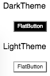

讨论地址：[《React UI库主题设计》讨论 #1](https://github.com/whinc/blog/issues/1)

# React组件库主题设计

基于 React 的 UI 组件库层出不穷，作为组件库很重要的一个功能就是实现主题换肤功能。通过组件库提供的主题定制接口，用户只需要修改一些组件的 UI 参数，就可以达到修改整个组件库样式。

目标：
* 可定制性强
* 易学易用

## 一种简单的主题设计方案

为了支持根据主题改变外观，组件库中每个组件都要求暴露一个`style`属性，以便外部可以通过传入不同样式控制组件的外观。
```javascript
<Button style={style}>
```

为了切换主题，先定义黑白两套主题。不同主题之间只是样式取值不一样，数据结构必须保持一致。每种主题详细定义了每个组件的`style`值。
```javascript
const DarkTheme = {
  ButtonStyle: {...},
  InputStyle: {...}
}

const LightTheme = {
  ButtonStyle: {...},
  InputStyle: {...}
}
```

接下来就是切换主题了，应用内不直接引用具体的某个主题，而是引用主题的抽象，由于不同主题数据结构相同，只需要在创建`theme`对象时，赋予不同的主题即可达到切换整个应用外观的目的。
```javascript
const theme = DarkTheme
//const theme = LightTheme
ReactDOM.render(
  <App>
    <Button style={theme.ButtonStyle} />
    <Input style={theme.InputStyle} />
  </App>
, node)
```

到这里，一个主题切换方案就设计完了。除了每次都要在组件中声明`style`为当前主题样式外，其他都比较满意，你可以修改全局主题，也可以修改单独某个组件的默认样式。
```javascript
const theme = DarkTheme
// 修改全局 Button 的默认样式
theme.ButtonStyle = {...this.ButtonStyle, color: 'red'}

ReactDOM.render(
  <App>
    {/* 修改单个 Button 的默认样式 */} 
    <Button style={[theme.ButtonStyle, {color: 'blue'}]} />
    <Input style={theme.InputStyle} />
  </App>
, node)
```

这种方式一个主要问题是：每个组件使用时需要指定`style`为指定的主题样式，对使用者不透明。如果能解决好这个问题，那这就会是一个简单强大的主题切换方案了，接下来解决这个问题。


## 基于 Context 的组件主题设计方案

Context 是 React 15 引入的实验特性（现实情况是已经广泛用于各种库），利用它可以实现从父组件传递数据给子（及后代）组件，而不必依赖于中间组件的层层传递，整个传递过程对中间的组件是透明的。

通过组件的 Context 特性，可以将在根组件中定义的主题对象直接传递给目标子组件，而不必显式地由外部传入`style`属性来设置默认主题样式。预期像下面这样使用主题：在根组件中传入主题配置，所有在根组件下的组件库中的组件都显示传入的主题外观。

```javascript
ReactDOM.render(
  <ThemeProvider theme={DarkTheme}>
    <div>
      <p>Theme test</p>
      <FlatButton title={'FlatButton'} />
    </div>
  </ThemeProvider>
, node)
```

思路有了，接下来就开始动手实现。

首先，定义一个的根组件命名为`ThemeProvider`（命名按喜好，无影响），它的`render`方法返回传入的`children`。这个组件充当一个主题配置分发的角色，它将传入的`theme`配置对象传递给子（及后代）组件。

```javascript
class ThemeProvider extends Component {
  static propTypes = {
    children: PropTypes.element,
    theme: PropTypes.object
  }

  static childContextTypes = {
    theme: PropTypes.object.isRequired
  }

  getChildContext() {
    return {
      theme: this.props.theme || createTheme()
    }
  }

  render() {
    return this.props.children
  }
}
```

然后，子（后代）组件中接收来自根组件的`context`对象，并读取`theme`配置对象，将样式应用到当前自身。

```javascript
class FlatButton extends Component {
  static propTypes = {
    title: PropTypes.string
  }

  static contextTypes = {
    theme: PropTypes.object.isRequired
  }

  render () {
    const {title} = this.props
    const {
      fontFamily,
      borderRadius,
      palette: {
        primaryColor,
        secondColor
      }
    } = this.context.theme
    return <button style={{backgroundColor: primaryColor, color: secondColor, fontFamily, borderRadius}}>{title}</button>
  }
}
```

OK，这就是全部了，现在可以向根组件`ThemeProvider`传入不同的主题配置改变整个UI库的外观。

```javascript
ReactDOM.render(
  <div style={{margin: 20}}>
    <p>DarkTheme</p>
    <ThemeProvider theme={createTheme(DarkTheme)}>
      <App />
    </ThemeProvider>
    <p>LightTheme</p>
    <ThemeProvider theme={createTheme(LightTheme)}>
      <App />
    </ThemeProvider>
  </div>
, node)
```




### 自定义组件的主题

等等有个问题，上面传递给根组件`ThemeProvider`的主题配置仅影响组件库中的组件外观，对自定义的组件没有效果。

下面`MyButton`是一个自定义组件，并非组件库提供的组件，放到页面上显示的是默认的浏览器样式。
```javascript
class MyButton extends Component {
  static propTypes = {
    title: PropTypes.string
  }

  render () {
    const {title} = this.props
    return <button>{title}</button>
  }
}
```


对比自定义组件与组件库中的组件代码，缺少了读取`context`对象中的`theme`对象并应用样式到自身的代码。补上这部分代码（从`context`中读取主题样式并应用到自身）后，自定义组件也可以和组件库中的组件一样，实现与当前主题保持外观一致变化。

自定义组件要做的工作就是定义`contextTypes`，然后在`render`中读取`context`中的主题配置并应用到自身样式。为每个自定义组件编写一次`contextTypes`定义十分乏味，这里利用高阶组件封装一下。

代码如下，`themeable`的主要任务是从根组件`ThemeProvider`中获取`theme`配置并传递给被包裹的组件。

```javascript
const themeable = () => {
  const getDisplayName = c => c.displayName || c.name || 'Component'
  return Component => {
    const WrappedComponent =  (props, context) => {
      const {theme = createTheme()} = context
      return <Component theme={theme} {...props} />
    }
    WrappedComponent.contextTypes = { 
      theme: PropTypes.object
    }
    WrappedComponent.displayName = getDisplayName(Component)
    return WrappedComponent
  }
}
```

自定义组件导出时，使用`themeable`修饰一下，之后使用时导入的`MyButton`组件中可以直接使用来自根组件`ThemeProvider`中提供的`theme`配置。
```javascript
class MyButton extends Component {
  static propTypes = {
    title: PropTypes.string
  }

  render () {
    const {title, theme} = this.props
    return <button style={{color: theme.palette.secondColor}}>{title}</button>
  }
}
export default themeble()(MyButton)
```

## 设置单个组件主题

前面提到了在`ThemeProvider`中提供一份`theme`配置对象，它包含了诸如调色板、字体、边框、间距、动画等配置，它会应用到所有组件库中的组件，同时也提供给自定义组件使用（通过`themeable`包装）。有时在开发某个组件时，希望该组件的样式可以单独定制，当前的`theme`配置结构无法满足，需要对配置结构进行细化，实现针对特定组件的主题定制。

首先，修改组件内部应用`theme`的优先级：优先使用主题配置中与当前组件匹配（一般按组件名）的样式。例如下面`FlatButton`优先使用`theme.flatButton`配置的样式。

```javascript
class FlatButton extends Component {
  static propTypes = {
    title: PropTypes.string
  }

  static contextTypes = {
    theme: PropTypes.object.isRequired
  }

  static defaultProps = {
    title: ''
  }

  render () {
    const {title} = this.props
    const {
      flatButton: {
        borderRadius,
        textColor,
        backgroundColor
      }
    } = this.context.theme
    return <button style={{ backgroundColor, color: textColor, borderRadius }}>{title}</button>
  }
}
```

主题配置对象中仅定义最小配置项，这样可以让主题配置非常精简，`createTheme()`函数接收主题配置对象，返回包含了特定组件的样式，组件默认主题样式基于最小配置项。

例如下面主题的配置只包含了调色板、字体、边框，`createTheme()`函数调用后返回的主题对象，包含了`FlatButton`的样式，创建的新的主题对象提供给`ThemeProvider`组件进行分发。
```javascript
const DarkTheme = {
  fontFamily: 'Roboto, sans-serif',
  borderRadius: 2,
  palette: {
    primaryColor: '#000000',
    secondColor: '#444444'
  }
}

function createTheme (theme = {}, ...more) {
  const noneUiTheme = merge({}, LightTheme, theme, ...more)

  const {borderRadius, palette, fontFamily} = noneUiTheme
  return merge({
    flatButton: {
      borderRadius: borderRadius,
      textColor: palette.textColor,
      backgroundColor: palette.primaryColor
    }
  }, noneUiTheme)
}

<ThemeProvider theme={createTheme(DardTheme)}>
  <!-- Your code -->
</ThemeProvider >
```

经过上面的改动后，组件的主题没有发生什么变化，但是增加了为组件单独设置主题的能力。下面例子中，创建了一份自定义的`customDarkTheme`主题，该主题针对`FlatButton`样式进行了定制，组件库中其他组件保持当前默认主题不变。

```javascript
import {ThemeProvider, createTheme, DarkTheme, LightTheme} from './none-ui'

// 继承 DarkTheme 并在此基础之上定制 FlatButton 组件的样式
const customDarkTheme = {
  ...DarkTheme,
  flatButton: {
    backgroundColor: 'red',
    textColor: 'white',
    borderRadius: 10
  }
}

ReactDOM.render(
  <div style={{margin: 20}}>
    <p>DarkTheme</p>
    <ThemeProvider theme={createTheme(DarkTheme)}>
      <App />
    </ThemeProvider>
    <p>Custom DarkTheme</p>
    <ThemeProvider theme={createTheme(customDarkTheme)}>
      <App />
    </ThemeProvider>
    <p>LightTheme</p>
    <ThemeProvider theme={createTheme(LightTheme)}>
      <App />
    </ThemeProvider>
  </div>
, document.getElementById('root'));
```


## 总结

文章首先介绍了一种简单直观的切换主题的实现方式，但这种方式要求每次使用组件时都要关心主题样式，对使用者不友好。针对这个问题，提供除了利用`React`的`Context`特性，在根组件中定义一次主题，所有使用到的组件库中的组件都显示当前主题，使用时无需关心主题样式。在此基础上，又介绍了自定义组件如何使用主题、如何修改特定组件的主题样式。

本文主要参考了[callemall/material-ui](https://github.com/callemall/material-ui)库的[v0.19.4](https://github.com/callemall/material-ui/tree/v0.19.4)版本的主题切换功能实现机制，将其中的重要部分提取出来并简化，方便学习。

文中的示例代码可以在Github上[whinc/react-theme-solutions](https://github.com/whinc/react-theme-solutions)找到，这个仓库中代中实现了一个具有主题切换功能的UI库。
