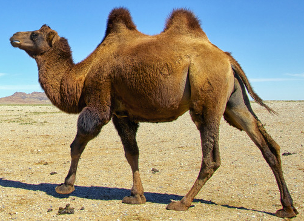

# 程序变量命名的几种叫法

计算机语言很多，无论哪种语言编写代码时都会遇到变量命名、方法命名等问题，网上关于代码命名风格的讨论已经多到无法形容了，甚至成为了程序员的一种价值观。今天不讨论命名风格孰优孰劣，仅整理下已有的命名风格作为了解，方便相互之间沟通。

<!--truncate-->
## camel case （驼峰式）

特点：名称中间没有空格和标点，除第一个单词外后面的单词首字母均大写。

如果第一个单词首字母大写，称之为`upper camel case`（`CamelCase`，大驼峰式），例如`"GetUserName"`。
如果第一个单词首字母小写，称之为`lower camel case`（`camelCase`，小驼峰式），例如`"getUserName"`。

>`upper camel case`还有一个称呼`Pascal case`

## snake case （蛇式）

特点：名称中间的标点被替换成下划线（`_`）。

如果所有单词都小写，称之为`lower snake case`（小蛇式），例如`"get_user_name"`。
如果所有单词都大写，称之为`upper snake case`（大蛇式），例如`"GET_USER_NAME"`。

## kebab case （烤肉串式）

特点：名称中间的标点被替换成连字符（`-`），所有单词都小写，例如`"get-user-name"`。

## 参考

* [Letter case - Special case styles](https://en.wikipedia.org/wiki/Letter_case#Special_case_styles)
* [lodash#cameCase](https://lodash.com/docs/4.17.4#camelCase)
* [lodash#snakeCase](https://lodash.com/docs/4.17.4#snakeCase)
* [lodash#kebabCase](https://lodash.com/docs/4.17.4#kebabCase)