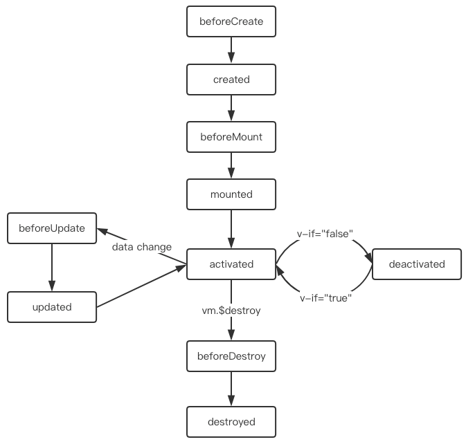
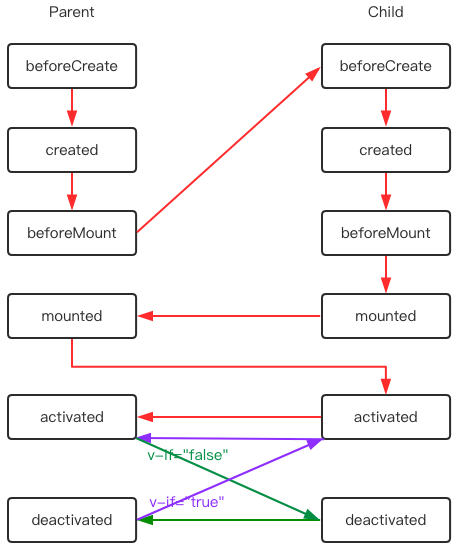
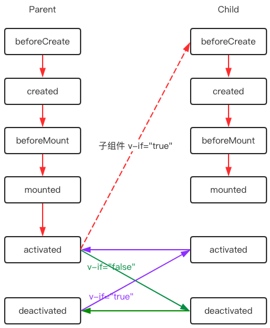
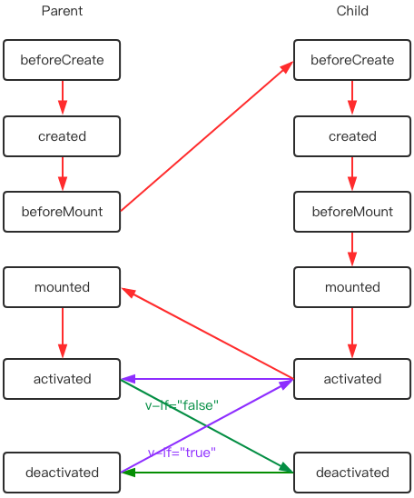

# Vue 生命周期梳理 

**目录**
1. 单组件生命周期
1. 父子组件生命周期
1. 使用 keep-alive 后的单组件生命周期
1. 使用 keep-alive 后的父子组件生命周期
1. 小结

组件化思维现在已得到广泛的认可，Vue 是围绕组件化构筑起来的框架。相比传统命令式 DOM 操作需要手动检查和处理 DOM 变化，Vue 以组件为单位，使用响应式数据自动更新 DOM，在组件生命周期中处理数据和 DOM 变化的各个阶段。基于 Vue 构建的交互界面始于一个根组件，将组件有组织的层层嵌套形成一颗组件树构建起复杂的网页应用。组件层层嵌套后，组件的生命周期方法调用的顺序变得很重要，尤其在处理一些需要父子组件联动的场景。本文先分析单组件的生命周期方法的执行时机，再考虑存在父子组件时，组件生命周期方法的执行顺序变化。

<!--truncate-->
## 单组件生命周期

单组件生命周期方法执行顺序参考 [Vue 官网](https://cn.vuejs.org/v2/guide/instance.html#%E7%94%9F%E5%91%BD%E5%91%A8%E6%9C%9F%E5%9B%BE%E7%A4%BA)，熟悉单组件的生命周期方法执行时机和行为，有利于后续面对复杂生命周期执行顺序时保持清醒。


**beforeCreate**

发生在组件实例化之后，数据观测 (data observer) 和 event/watcher 事件配置之前。此时数据还不是响应式，更新 data 数据是无效的，也无法访问 DOM。
```js
 data () {
    return {
      count: 0
    }
  },
  beforeCreate() {
    this.count = 10;
    console.log("beforeCreate", this.$el); // beforeCreate undefined
  },
  created() {
    console.log("created", this.count); // created 0
  }

```

**created**

发生在组件实例创建之后，已完成配置：数据观测 (data observer)、计算属性、方法、watch/event 事件回调。此时数据是响应式，不能访问 DOM。网络数据请求操作适合放在此处。

```js
 data () {
    return {
      count: 0
    }
  }
  created() {
    this.count = 10;
    console.log("created", this.$el); // created undefined
  }
  mounted() {
    console.log("mounted", this.count);    // mounted 10
  }
```

**beforeMount**
发生在 DOM 挂载之前。此时模板或渲染函数已经编译好，相关的 render 函数首次被调用，不能访问 DOM。
```js
  beforeMount() {
    console.log("beforeMount", this.$el); // beforeMount undefined
  }
```

**mounted**
发生在组件挂载到 DOM 之后。此时可以访问 DOM 节点，例如`this.$el`，DOM 相关的操作适合放在此处。

```js
  mounted() {
    console.log("mounted", this.$el); // mounted <div id="app"></div>
  }
```

**beforeUpdate**
发生在组件数据变化之后 DOM 更新之前。此时访问 DOM 是数据变化前对应的 DOM。
```html
<template>
  <span ref="count">{{ count }}</span>
</template>
```
```js
 data () {
    return {
      count: 0
    }
  },
  mounted() {
    this.count = 10;
  },
  // 数据变化但 DOM 尚未更新，获取的 DOM 数据不是最新的
  beforeUpdate() {
    console.log("beforeUpdate", this.count, this.$refs.count.textContent); // beforeUpdate 10 0
  },
```

**updated**
发生在组件数据变化导致的 DOM 更新之后。此时可访问更新后的 DOM 节点，DOM 与 data 数据一致。

```html
<template>
  <span ref="count">{{ count }}</span>
</template>
```
```js
 data () {
    return {
      count: 0
    }
  },
  mounted() {
    this.count = 10;
  },
  beforeUpdate() {
    console.log("beforeUpdate", this.count, this.$refs.count.textContent); // beforeUpdate 10 0
  },
  // 数据变化且 DOM 已更新，获取的 DOM 数据是最新的
  updated() {
    console.log("updated", this.count, this.$refs.count.textContent); // beforeUpdate 10 10
  }
```

**beforeDestroy**
发生在组件实例销毁之前。此时实例仍然完全可用。

**destroyed**
发生组件实例销毁之后。此时组件所有东西都已解绑，所有的事件监听器都已被移除，还能访问 DOM。
```js
  data() {
    return {
      count: 0
    };
  },
  computed: {
    tenTimesCount() {
      return this.count * 10;
    }
  },
  // 解除数据响应，修改数据后计算属性不会再更新了
  destroyed() {
    this.count = 2;
    console.log("destroyed", this.$el, this.count, this.tenTimesCount);  // destroyed <div id="app"></div> 2 0
  }
```

## 父子组件生命周期

下面是父子组件情形，以父组件的更新视角整理周期方法执行先后顺序如下图。
```html
<Parent>
  <Child :count="parentCount" />
</Parent>
```

首次加载生命周期方法执行顺序：
```
[parent] beforeCreate 
[parent] created 
[parent] beforeMount 
[child ] beforeCreate 
[child ] created 
[child ] beforeMount 
[child ] mounted 
[parent] mounted 
```
父子组件同时更新时生命周期方法执行顺序：
```
[parent] beforeUpdate 
[child ] beforeUpdate 
[child ] updated 
[parent] updated 
```
销毁父组件时生命周期方法执行顺序：
```
[parent] beforeDestroy 
[child ] beforeDestroy 
[child ] destroyed 
[parent] destroyed 
```

生命周期方法执行顺序示意图表示：


从图中可知：
* 创建阶段，先挂载子组件到 DOM，再挂载父组件到 DOM。
* 更新阶段，先更新子组件，再更新父组件。**注意**，父子组件同时存在更新时才有这个顺序，如果只有父组件更新，则只触发父组件的生命周期方法，子组件生命周期方法不会触发。
* 销毁阶段：先销毁子组件，再销毁父组件。

所以总的来说，父子组件生命周期执行先后顺序是：**先执行子组件生命周期方法，再执行父组件生命周期方法**。

## 使用 keep-alive 后的单组件生命周期

下面是单组件被`<keep-alive>`包裹时的情形：
```html
<keep-alive>
  <Comp/>
</keep-alive>
```

使用`<keep-alive>`指令后 Vue 会保存组件状态，组件切换时不会触发销毁和重建，为了暴露组件隐藏和显示的时机，Vue 对`<keep-alive>`包裹的子组件及后代组件新增了一对生命周期方法`activated`和`deactivated`，分别在组件切换显示和隐藏时调用。

使用`<keep-alive>`包裹后的单组件生命周期示意图如下：


>注意：通过`v-show`切换组件不会触发`activated`和`deactivated`，因为`v-show`并不会触发组件的销毁和重建，仅仅是样式上的隐藏和显示。

## 使用 keep-alive 后的父子组件生命周期

**情形一：仅父组件由 keep-alive 包裹且初始时存在**
下面代码模拟了单页路由且缓存页面的情形，父组件通过`v-if`模拟页面切换，使用`<keep-alive>`包裹父组件实现页面状态缓存，父子组件的生命周期方法执行顺序如下。
```html
<App>
  <keep-alive>
    <Parent v-if="showParent">
      <Child></Child>
    </Parent>
  </keep-alive>
<App>

data () {
  return {
    showParent: true
  }
}
```

首次加载生命周期方法执行顺序：
```
[parent] beforeCreate 
[parent] created 
[parent] beforeMount 
[child ] beforeCreate 
[child ] created 
[child ] beforeMount 
[child ] mounted 
[parent] mounted 
[child ] activated 
[parent] activated 
```
设置`showParent`为`false`：
```
[child ] deactivated 
[parent] deactivated 
```
设置`showParent`为`true`：
```
[child ] activated 
[parent] activated 
```
生命周期方法执行顺序示意图表示：


分析：首次加载时，先 mount 子组件，然后 mount 父组件，然后`<keep-alive>`组件触发 activated 周期方法，先 activated 子组件再 activated 父组件。后续父组件切换时，由于被缓存不会触发销毁重建，取而代之触发 activated 和 deactivated 周期方法，也是先 activated 子组件再 activated 父组件。

**情形二：仅父组件由 keep-alive 包裹且初始时子组件不存在**

和情形一的差异是初始时组件不展示，等待请求后台数据后再展示，这是业务中比较常见的情形，该情形下父子组件生命周期方法执行顺序如下。
```html
<App>
  <keep-alive>
    <Parent v-if="showParent">
      <Child v-if="showChild"></Child>
    </Parent>
  </keep-alive>
<App>

data () {
  return {
    showParent: true,
    showChild: false
  }
}
mounted () {
   // 模拟数据请求，2s后显示子组件
  setTimeout(() => this.showChild = true, 2000)
}
```

首次加载并等待数据加载完毕，生命周期方法执行顺序：
```
[parent] beforeCreate 
[parent] created 
[parent] beforeMount 
[parent] mounted 
[parent] activated 
[child ] beforeCreate 
[child ] created 
[child ] beforeMount 
[child ] mounted 
```

设置`showParent`为`false`：
```
[child ] deactivated 
[parent] deactivated 
```
设置`showParent`为`true`：
```
[child ] activated 
[parent] activated 
```
执行顺序用示意图表示：


分析：首次加载时，子组件不存在，所以只执行父组件的生命周期方法 mounted 和 activated，等待请求的网络数据返回后显示子组件，触发子组件生命周期方法 mounted。注意**子组件的 activated 方法在创建时不会触发**。后续父组件切换时，由于被缓存不会触发销毁重建，取而代之触发 activated 和 deactivated 周期方法，也是先 activated 子组件再 activated 父组件。

**情形三：父子组件都由 keep-alive 包裹且初始时存在**
下面代码模拟了单页嵌套路由且缓存页面的情形。
```html
<App>
  <keep-alive>
    <Parent v-if="showParent">
      <keep-alive>
        <Child></Child>
      </keep-alive>
    </Parent>
  </keep-alive>
<App>

data () {
  return {
    showParent: true
  }
}
```

首次加载生命周期方法执行顺序：
```
[parent] beforeCreate 
[parent] created 
[parent] beforeMount 
[child ] beforeCreate 
[child ] created 
[child ] beforeMount 
[child ] mounted 
[child ] activated 
[parent] mounted 
[parent] activated 
```
设置`showParent`为`false`：
```
[child ] deactivated 
[parent] deactivated 
```
设置`showParent`为`true`：
```
[child ] activated 
[parent] activated 
```
执行顺序示意图：


分析：首次加载时，先 mount 子组件，包裹子组件的`<keep-alive>`组件触发 activated 周期方法。然后 mount 父组件，包裹父组件的`<keep-alive>`组件触发 activated 周期方法，先子组件后父组件。后续父组件切换时，由于被缓存不会触发销毁重建，取而代之触发 activated 和 deactivated 周期方法，也是先子组件后父组件。

## 小结

Vue 暴露了丰富的生命周期方法给使用者，让我们有机会介入到组件从创建到销毁过程中的各个重要阶段，熟悉每个生命周期方法的执行时机和产生的影响可以帮助更好的实现需求。本文分析了单组件、父子组件以及存在`<keep-alive>`时组件生命周期方法执行顺序的变化，这些组合可以覆盖日常大多数场景。