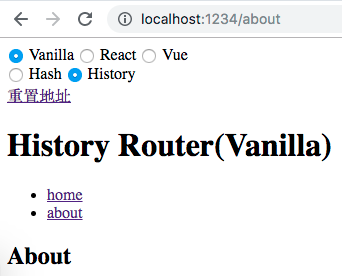
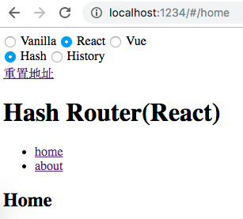
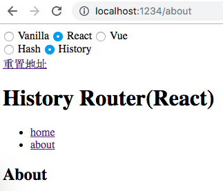
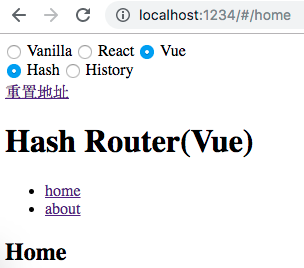
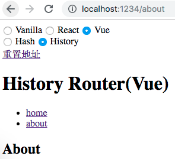

# Web 前端路由原理解析和实现

>在单页应用如此流行的今天，曾经令人惊叹的前端路由已经成为各大框架的基础标配，每个框架都提供了强大的路由功能，导致路由实现变的复杂。想要搞懂路由内部实现还是有些困难的，但是如果只想了解路由实现基本原理还是比较简单的。本文针对前端路由主流的实现方式 hash 和 history，提供了原生JS/React/Vue 共计六个版本供参考，每个版本的实现代码约 25~40 行左右（含空行）。
<!--truncate-->
## 什么是前端路由？

路由的概念来源于服务端，在服务端中路由描述的是 URL 与处理函数之间的映射关系。

在 Web 前端单页应用 SPA(Single Page Application)中，路由描述的是 URL 与 UI 之间的映射关系，这种映射是单向的，即 URL 变化引起 UI 更新（无需刷新页面）。

## 如何实现前端路由？

要实现前端路由，需要解决两个核心问题：
1. 如何改变 URL 却不引起页面刷新？
2. 如何检测 URL 变化了？

下面分别使用 hash 和 history 两种实现方式回答上面的两个核心问题。

**hash 实现**
1. hash 是 URL 中 hash (`#`) 及后面的那部分，常用作锚点在页面内进行导航，改变 URL 中的 hash 部分不会引起页面刷新
2. 通过 [hashchange](https://developer.mozilla.org/en-US/docs/Web/API/Window/hashchange_event) 事件监听 URL 的变化，改变 URL 的方式只有这几种：通过浏览器前进后退改变 URL、通过`<a>`标签改变 URL、通过`window.location`改变URL，这几种情况改变 URL 都会触发 hashchange 事件

**history 实现**
1. history 提供了 pushState 和 replaceState 两个方法，这两个方法改变 URL 的 path 部分不会引起页面刷新
2. history 提供类似 hashchange 事件的 [popstate](https://developer.mozilla.org/en-US/docs/Web/API/Window/popstate_event) 事件，但 popstate 事件有些不同：通过浏览器前进后退改变 URL 时会触发 popstate 事件，通过`pushState/replaceState`或`<a>`标签改变 URL 不会触发 popstate 事件。好在我们可以拦截 `pushState/replaceState`的调用和`<a>`标签的点击事件来检测 URL 变化，所以监听 URL 变化可以实现，只是没有 hashchange 那么方便。

## 原生JS版前端路由实现

基于上节讨论的两种实现方式，分别实现 hash 版本和 history 版本的路由，示例使用原生 HTML/JS 实现，不依赖任何框架。 

### 基于 hash 实现

运行效果：


HTML 部分：
```html
<body>
  <ul>
    <!-- 定义路由 -->
    <li><a href="#/home">home</a></li>
    <li><a href="#/about">about</a></li>

    <!-- 渲染路由对应的 UI -->
    <div id="routeView"></div>
  </ul>
</body>
```
JavaScript 部分：
```js
// 页面加载完不会触发 hashchange，这里主动触发一次 hashchange 事件
window.addEventListener('DOMContentLoaded', onLoad)
// 监听路由变化
window.addEventListener('hashchange', onHashChange)

// 路由视图
var routerView = null

function onLoad () {
  routerView = document.querySelector('#routeView')
  onHashChange()
}

// 路由变化时，根据路由渲染对应 UI
function onHashChange () {
  switch (location.hash) {
    case '#/home':
      routerView.innerHTML = 'Home'
      return
    case '#/about':
      routerView.innerHTML = 'About'
      return
    default:
      return
  }
}
```

### 基于 history 实现

运行效果：


HTML 部分：
```html
<body>
  <ul>
    <li><a href='/home'>home</a></li>
    <li><a href='/about'>about</a></li>

    <div id="routeView"></div>
  </ul>
</body>
```

JavaScript 部分：
```js
// 页面加载完不会触发 hashchange，这里主动触发一次 hashchange 事件
window.addEventListener('DOMContentLoaded', onLoad)
// 监听路由变化
window.addEventListener('popstate', onPopState)

// 路由视图
var routerView = null

function onLoad () {
  routerView = document.querySelector('#routeView')
  onPopState()

  // 拦截 <a> 标签点击事件默认行为， 点击时使用 pushState 修改 URL并更新手动 UI，从而实现点击链接更新 URL 和 UI 的效果。
  var linkList = document.querySelectorAll('a[href]')
  linkList.forEach(el => el.addEventListener('click', function (e) {
    e.preventDefault()
    history.pushState(null, '', el.getAttribute('href'))
    onPopState()
  }))
}

// 路由变化时，根据路由渲染对应 UI
function onPopState () {
  switch (location.pathname) {
    case '/home':
      routerView.innerHTML = 'Home'
      return
    case '/about':
      routerView.innerHTML = 'About'
      return
    default:
      return
  }
}
```

## React 版前端路由实现

### 基于 hash 实现

运行效果：



使用方式和 react-router 类似：
```jsx
  <BrowserRouter>
    <ul>
      <li>
        <Link to="/home">home</Link>
      </li>
      <li>
        <Link to="/about">about</Link>
      </li>
    </ul>

    <Route path="/home" render={() => <h2>Home</h2>} />
    <Route path="/about" render={() => <h2>About</h2>} />
  </BrowserRouter>
```

BrowserRouter 实现
```jsx
export default class BrowserRouter extends React.Component {
  state = {
    currentPath: utils.extractHashPath(window.location.href)
  };

  onHashChange = e => {
    const currentPath = utils.extractHashPath(e.newURL);
    console.log("onHashChange:", currentPath);
    this.setState({ currentPath });
  };

  componentDidMount() {
    window.addEventListener("hashchange", this.onHashChange);
  }

  componentWillUnmount() {
    window.removeEventListener("hashchange", this.onHashChange);
  }

  render() {
    return (
      <RouteContext.Provider value={{currentPath: this.state.currentPath}}>
        {this.props.children}
      </RouteContext.Provider>
    );
  }
}
```

Route 实现
```jsx
export default ({ path, render }) => (
  <RouteContext.Consumer>
    {({currentPath}) => currentPath === path && render()}
  </RouteContext.Consumer>
);
```

Link 实现
```jsx
export default ({ to, ...props }) => <a {...props} href={"#" + to} />;
```

### 基于 history 实现

运行效果：


使用方式和 react-router 类似：
```jsx
  <HistoryRouter>
    <ul>
      <li>
        <Link to="/home">home</Link>
      </li>
      <li>
        <Link to="/about">about</Link>
      </li>
    </ul>

    <Route path="/home" render={() => <h2>Home</h2>} />
    <Route path="/about" render={() => <h2>About</h2>} />
  </HistoryRouter>
```

HistoryRouter 实现
```jsx
export default class HistoryRouter extends React.Component {
  state = {
    currentPath: utils.extractUrlPath(window.location.href)
  };

  onPopState = e => {
    const currentPath = utils.extractUrlPath(window.location.href);
    console.log("onPopState:", currentPath);
    this.setState({ currentPath });
  };

  componentDidMount() {
    window.addEventListener("popstate", this.onPopState);
  }

  componentWillUnmount() {
    window.removeEventListener("popstate", this.onPopState);
  }

  render() {
    return (
      <RouteContext.Provider value={{currentPath: this.state.currentPath, onPopState: this.onPopState}}>
        {this.props.children}
      </RouteContext.Provider>
    );
  }
}
```

Route 实现
```jsx
export default ({ path, render }) => (
  <RouteContext.Consumer>
    {({currentPath}) => currentPath === path && render()}
  </RouteContext.Consumer>
);
```

Link 实现
```jsx
export default ({ to, ...props }) => (
  <RouteContext.Consumer>
    {({ onPopState }) => (
      <a
        href=""
        {...props}
        onClick={e => {
          e.preventDefault();
          window.history.pushState(null, "", to);
          onPopState();
        }}
      />
    )}
  </RouteContext.Consumer>
);
```

## Vue 版本前端路由实现

### 基于 hash 实现

运行效果：


使用方式和 vue-router 类似（vue-router 通过插件机制注入路由，但是这样隐藏了实现细节，为了保持代码直观，这里没有使用 Vue 插件封装）：
```html
    <div>
      <ul>
        <li><router-link to="/home">home</router-link></li>
        <li><router-link to="/about">about</router-link></li>
      </ul>
      <router-view></router-view>
    </div>
```

```js
const routes = {
  '/home': {
    template: '<h2>Home</h2>'
  },
  '/about': {
    template: '<h2>About</h2>'
  }
}

const app = new Vue({
  el: '.vue.hash',
  components: {
    'router-view': RouterView,
    'router-link': RouterLink
  },
  beforeCreate () {
    this.$routes = routes
  }
})
```

router-view 实现
```html
<template>
  <component :is="routeView" />
</template>

<script>
import utils from '~/utils.js'
export default {
  data () {
    return {
      routeView: null
    }
  },
  created () {
    this.boundHashChange = this.onHashChange.bind(this)
  },
  beforeMount () {
    window.addEventListener('hashchange', this.boundHashChange)
  },
  mounted () {
    this.onHashChange()
  },
  beforeDestroy() {
    window.removeEventListener('hashchange', this.boundHashChange)
  },
  methods: {
    onHashChange () {
      const path = utils.extractHashPath(window.location.href)
      this.routeView = this.$root.$routes[path] || null
      console.log('vue:hashchange:', path)
    }
  }
}
</script>
```

router-link 实现
```html
<template>
  <a @click.prevent="onClick" href=''><slot></slot></a>
</template>

<script>
export default {
  props: {
    to: String
  },
  methods: {
    onClick () {
      window.location.hash = '#' + this.to
    }
  }
}
</script>
```

### 基于 history 实现

运行效果：


使用方式和 vue-router 类似：
```html
    <div>
      <ul>
        <li><router-link to="/home">home</router-link></li>
        <li><router-link to="/about">about</router-link></li>
      </ul>
      <router-view></router-view>
    </div>
```

```js
const routes = {
  '/home': {
    template: '<h2>Home</h2>'
  },
  '/about': {
    template: '<h2>About</h2>'
  }
}

const app = new Vue({
  el: '.vue.history',
  components: {
    'router-view': RouterView,
    'router-link': RouterLink
  },
  created () {
    this.$routes = routes
    this.boundPopState = this.onPopState.bind(this)
  },
  beforeMount () {
    window.addEventListener('popstate', this.boundPopState) 
  },
  beforeDestroy () {
    window.removeEventListener('popstate', this.boundPopState) 
  },
  methods: {
    onPopState (...args) {
      this.$emit('popstate', ...args)
    }
  }
})
```

router-view 实现：
```html
<template>
  <component :is="routeView" />
</template>

<script>
import utils from '~/utils.js'
export default {
  data () {
    return {
      routeView: null
    }
  },
  created () {
    this.boundPopState = this.onPopState.bind(this)
  },
  beforeMount () {
    this.$root.$on('popstate', this.boundPopState)
  },
  beforeDestroy() {
    this.$root.$off('popstate', this.boundPopState)
  },
  methods: {
    onPopState (e) {
      const path = utils.extractUrlPath(window.location.href)
      this.routeView = this.$root.$routes[path] || null
      console.log('[Vue] popstate:', path)
    }
  }
}
</script>
```

router-link 实现
```html
<template>
  <a @click.prevent="onClick" href=''><slot></slot></a>
</template>

<script>
export default {
  props: {
    to: String
  },
  methods: {
    onClick () {
      history.pushState(null, '', this.to)
      this.$root.$emit('popstate')
    }
  }
}
</script>
```

## 小结

前端路由的核心实现原理很简单，但是结合具体框架后，框架增加了很多特性，如动态路由、路由参数、路由动画等等，这些导致路由实现变的复杂。本文去粗取精只针对前端路由最核心部分的实现进行分析，并基于 hash 和 history 两种模式，分别提供原生JS/React/Vue 三种实现，共计六个实现版本供参考，希望对你有所帮助。

所有的示例的代码放在 Github 仓库：https://github.com/whinc/web-router-principle

## 参考
* [详解单页面路由的几种实现原理](http://www.cnblogs.com/xiaobie123/p/6357724.html)
* [单页面应用路由实现原理：以 React-Router 为例](https://github.com/youngwind/blog/issues/109)

