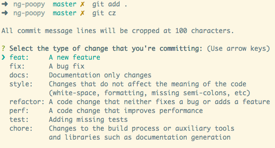

# JavaScript 项目必备配置

本文介绍一些前端项目的通用配置及相关资源，以便你了解项目中常见配置的含义以及配置方式。

目录
- .gitignore - 让 Git 提交时忽略文件
- editorconfig - 让编辑器或IDEs保持一致的编码样式
- husky - 使用 git hooks 触发动作
- lint-staged - 对 git 暂存区匹配的文件执行动作
- commitzen - 命令行交互式生成符合[约定式提交规范](https://www.conventionalcommits.org/zh-hans)的 commit message
- commitlint - 确保 commit message 符合约定式提交规范
- Prettier - 美化代码格式
- ESLint - 检查 JS 代码质量
- Stylelint - 检查 CSS 代码质量

<!--truncate-->

## [.gitignore](https://git-scm.com/book/en/v2/Git-Basics-Recording-Changes-to-the-Repository) - 让 Git 提交时忽略文件
 
通过`.gitignore`文件可将项目中符合规则的文件忽略掉，避免提交带有敏感信息或不需要共享的文件到 Git 仓库。

JavaScript 项目常用配置：
```
# dependencies
/node_modules

# testing
/coverage

# production
/build

# vscode
.vscode/*
!.vscode/settings.json
!.vscode/tasks.json
!.vscode/launch.json
!.vscode/extensions.json

# env
.env.local
.env.*.local

# misc
.DS_Store

# package manager
npm-debug.log*
yarn-debug.log*
yarn-error.log*
```
 
[gitignore]( https://github.com/github/gitignore) 是 Github 官方维护的一份 git ignore 配置，可从中查找所需配置规则。

## [.editorconfig](https://editorconfig.org/) - 让编辑器或IDEs保持一致的编码样式
 
EditorConfig可以帮助在不同的编辑器和IDE上从事同一项目的多个开发人员保持一致的编码样式。 EditorConfig项目包括一个用于定义编码样式的文件格式和一个文本编辑器插件集合，这些文本编辑器插件使编辑器可以读取文件格式并遵循定义的样式。 EditorConfig文件易于阅读，并且可以与版本控制系统很好地协同工作。
 
配置示例：
```ini
# editorconfig.org
root = true
 
[*]
indent_style = space
indent_size = 2
end_of_line = lf
charset = utf-8
trim_trailing_whitespace = true
insert_final_newline = true
 
[*.md]
trim_trailing_whitespace = false
```
 
更多配置参考 [EditorConfig](https://editorconfig.org/)

## [husky](https://github.com/typicode/husky) - 使用 git hooks 触发动作

借助 husky 可以很方便的在 git push, git commit 等命令时执行一些附加动作，例如检查 commit message 是否符合规范、对代码进行检查和格式化等。
 
通过 npm 安装
```
npm install husky --save-dev
```

在 pacakge.json 中添加动作
```json
{
  "husky": {
    "hooks": {
      "pre-commit": "npm test",
      "pre-push": "echo $HUSKY_GIT_PARAMS",
      "...": "..."
    }
  }
}
```

## [lint-staged](https://github.com/okonet/lint-staged)  - 对 git 暂存区匹配的文件执行动作

在提交代码前，通常会对代码进行质量检测、代码格式化等操作，但这些操作默认会对整个项目进行处理，对于稍大的项目，这个过程可能会异常慢。其实，我们只需要对本次要提交到 git 仓库的变更文件，进行检测即可避免代码流入仓库。通常每次提交所包含的变更文件是比较少的，这可以大大加速代码检测的速度。

借助 lint-staged 可以对 git 暂存区匹配的文件执行一组动作。

通过 npm 安装
```
npm install --save-dev lint-staged
```

在 package.json 中配置匹配文件(glob 匹配模式)和要执行的动作命令。
```json
{
  "lint-staged": {
    "*.js": "your-cmd"
  }
}
```

对于上面的配置，如果你刚执行了`git add file1.ext file2.ext`，lint-staged 将会执行如下命令`your-cmd file1.ext file2.ext`
 
## [commitizen](https://github.com/commitizen/cz-cli) - 命令行交互式生成符合约定式提交规范的 commit message
 
使用 Commitizen 进行提交时，系统会提示您在提交时填写所有必需的提交字段，你只需要根据提示填写提交信息，Commitizen 会保证最终提交的消息符合 [约定式提交规范](https://www.conventionalcommits.org/zh-hans)。



如果你的项目是对  Commitizen 友好的（即已经安装了 Commitizen 依赖），则在项目下提交消息时可直接使用`npx git-cz`来替代`git commit`命令。否则，你需要按照下面指引安装依赖，让你的项目变为对  Commitizen 友好的。

**使项目对 Commitizen 友好**

通过 npm 安装
```bash
npm install --save-dev commitizen
```

初始化适配器
```
npx commitizen init cz-conventional-changelog --save-dev --save-exact
```
 
提交代码
```bash
# 暂存修改的代码
git add .

# 提交代码，该命令替代 git commit
npx git-cz

# 重新提交（使用上次输入的 commit 消息，这在提交失败后再次提交时特别有用）
npx git-cz --retry
```

参考[Commit message 和 Change log 编写指南](http://www.ruanyifeng.com/blog/2016/01/commit_message_change_log.html)。


## [commitlint](https://github.com/conventional-changelog/commitlint) - 确保 commit message 符合约定式提交规范

借助 commitizen 可以辅助生成符合约定式提交规范的 commit message，但是这种方式无法确保项目其他成员也会遵循，即使有开发文档约束，但缺乏强制力，依然会有成员忘记按这种规范编写 commit message。此时，需要借助 commitlint 在提交之前检测 commit message 是否合乎规范。

通过 npm 安装
```bash
npm install --save-dev @commitlint/config-conventional @commitlint/cli
```

在 package.json 中进行配置
```json
{
  "commitlint": {
    "extends": [
      "@commitlint/config-conventional"
    ]
  }
}
```

约定式提交规范规定 commit message 需满足下面格式，其中 type 和 description 是必填项，有效的 type 值有 fix/feat/chore/docs/refactors/build/ci/style/perf/test 以及其他。
```
<type>[optional scope]: <description>

[optional body]

[optional footer(s)]
```

命令行测试
```bash
# Error，会输出错误信息
echo "xxx" | npx commitlint

# OK
echo "fix: xxx" | npx commitlint
```

与 husky 一起配合使用，提交前对 commit message 进行校验
```json
{
  "husky": {
    "hooks": {
      "commit-msg": "commitlint -E HUSKY_GIT_PARAMS"
    }
  }
}
```
 
## [Prettier](https://prettier.io/docs/en/install.html) - 美化代码格式

Prettier 是一个代码格式化程序（处理缩进、换行、空格等），它解析代码成抽象语法树(AST)并根据自定义格式重新输出代码，保证代码逻辑不变的前提下代码格式统一。它支持众多常见语言，例如 js/jsx/ts/tsx/json/css/scss/vue/yaml 等。

**格式化指定文件**

通过 npm 安装
```
npm install --save-dev prettier
```

执行下面命令后，prettier 格式化指定文件，并写回原文件（指定`--write`参数）。
```
npx prettier --write "src/**/*.js"
```

**格式化本次 git 提交的文件**

通过 npm 安装依赖
```bash
npm install --save husky lint-staged
```

在`package.json`中添加如下配置，之后执行`git commit`前会对本次提交的文件进行格式化，并添加到本次提交内容中。也可以直接执行`npx lint-staged`格式化本次待提交文件。
```json
  "husky": {
    "hooks": {
      "pre-commit": "lint-staged"
    }
  },
  "lint-staged": {
    "src/**/*.{js,jsx,ts,tsx,json,css,scss,md}": [
      "prettier --write",
      "git add"
    ]
  }
```

创建 [.prettierrc](https://prettier.io/docs/en/configuration.html) 配置文件进行自定义。

 ## [ESLint]( https://eslint.org/) - 检查 JS 代码质量
 
ESLint 是一个可插拔的 JS 和 JSX 检查工具。
 
**检查指定文件** 

通过 npm 安装
```
npm install --save-dev eslint
```

执行下面命令后，eslint 会读取项目下的配置文件，然后对输入文件进行检查，并输出检查结果。
```
npx eslint "src/**/*.js"
```

**检查本次 git 提交的文件**

通过 npm 安装依赖
```bash
npm install --save-dev husky lint-staged
```

在`package.json`中添加如下配置，之后执行`git commit`前 eslint 会对本次提交文件进行检查，如果检查存在问题（即 shell 指令返回非 0）则终止本次提交。
```json
  "lint-staged": {
    "src/**/*.{js,jsx}": "eslint"
  },
  "husky": {
    "hooks": {
      "pre-commit": "lint-staged"
    }
  }
```
 
创建 [.eslintrc](https://eslint.org/docs/user-guide/configuring) 配置文件进行自定义，如果不知道如何配置，可执行`eslint --init`，然后根据提示做出选择，eslint 会自动生成一份配置文件。

 
## [Stylelint](http://stylelint.cn/)- 检查 CSS 代码质量

Stylelint 是一个强大的现代 CSS 检测器，可以让你在样式表中遵循一致的约定和避免错误。

通过 npm 安装
```
npm install --save-dev stylelint
```

使用 CLI 检测样式文件
```
npx stylelint "src/**/*.css"
```


结合 husky 使用，在提交代码前执行检查
```json
  "husky": {
    "hooks": {
      "pre-commit": "stylelint src/**/*.css"
    }
  }
```

结合 husky 和 lint-staged 一起使用，检查本次提交中修改的文件
```json
  "lint-staged": {
    "src/**/*.css": "stylelint"
  },
  "husky": {
    "hooks": {
      "pre-commit": "lint-staged"
    }
  }
```


创建 [.stylelintrc](http://stylelint.cn/user-guide/configuration/) 配置文件进行自定义。

预设配置
* [ stylelint-config-recommended ]( https://github.com/stylelint/stylelint-config-recommended )

## 参考
 
[node-blog 3.1 开发前的项目配置](https://github.com/liuxing/abc-blog/tree/master/docs/3.1%E5%BC%80%E5%8F%91%E5%89%8D%E7%9A%84%E9%A1%B9%E7%9B%AE%E9%85%8D%E7%BD%AE.md)

## 最后

暂时先到这里，后续根据实际使用情况和工具变化再进行更新，如有问题，欢迎指正。