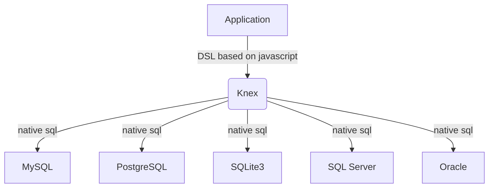

# Knex.js 教程

## 什么是 Knex.js ？

[Knex.js](https://github.com/knex/knex) 是一个流行的Node.js SQL查询构建器，它允许你使用JavaScript语言编写SQL查询，而无需直接编写SQL语句。它支持多种数据库，包括MySQL，PostgreSQL，SQLite和Microsoft SQL Server等。

使用Knex.js，你可以轻松地构建复杂的SQL查询，包括联接、子查询和聚合函数等。它还提供了一些方便的功能，如事务处理，批量插入和更新等，更多信息参考[Knex.js Guide](https://knexjs.org/guide)

下面是 Knex 的使用示例，使用 js 实现的 DSL 读写上与 SQL 非常相似。

import RunKitEmbed from '@site/src/components/RunKitEmbed';
import preamble from '!!raw-loader!./preamble'

<RunKitEmbed 
evaluateOnLoad
source={`
${preamble}
p(db.table('aa').select('b', 'c'))
`} />

<!--truncate-->

:::tip

修改上面交互式代码，并运行查看生成的 SQL 语句进行探索。

:::

## 优缺点

由于 Node.js 没有提供像 java 中的 JDBC 这样的数据库访问抽象层，导致基于原生的 Node.js 进行数据库编程时，需要面向不同的数据库类型提供的底层 SDK 编程，学习成本高、不可移植。

Knex 建立在底层数据库提供的 SDK 之上，提供统一的 API 数据库接口，可以将其看成是 Node.js 中类似"JDBC"的存在，代码与底层数据库耦合弱，方便在数据库之间迁移（如本地开发测试用 sqlite3，线上用MySQL），无需学习 SQL 方言。



优点：
- **简单易用**：Knex.js提供了一种简单而直观的API，使得构建和执行SQL查询变得非常容易。
- **跨数据库支持**：Knex.js支持多种数据库，包括MySQL、PostgreSQL、SQLite和Oracle等，使得开发人员可以轻松地在不同的数据库之间切换。
- **安全性**：Knex.js提供了一些安全功能，例如参数化查询和防止SQL注入攻击等，可以帮助开发人员保护应用程序免受安全漏洞的影响。
- **可测试性**：Knex.js的查询构建器可以轻松地进行单元测试，使得开发人员可以更轻松地测试其应用程序的查询逻辑。

缺点：
- **性能**：Knex.js的性能可能不如原生的SQL查询，因为它需要将查询构建器转换为SQL查询语句，这可能会导致一些性能损失。
- **限制**：Knex.js的查询构建器可能无法满足所有的查询需求，因为它是基于一组预定义的API构建的，而不是原生的SQL查询语句。

:::info

上面缺点中提到了性能和限制在实际中不必过于担心，因为 kenx.js 支持执行原生 SQL，对于追求高性能和自由性的场景，使用原生 SQL 替代即可。

:::


## 应用场景

- Web应用程序：Knex.js可以用于构建Web应用程序的后端，以便与数据库进行交互。它可以帮助开发人员轻松地构建和执行SQL查询，从而简化了Web应用程序的开发过程。
- 数据分析：Knex.js可以用于数据分析应用程序，以便从数据库中检索和分析数据。它可以帮助开发人员轻松地构建复杂的查询，从而使数据分析变得更加容易。
- 数据库管理工具：Knex.js可以用于构建数据库管理工具，以便管理和维护数据库。它可以帮助开发人员轻松地执行数据库操作，例如创建表格、插入数据和更新数据等。
- 服务器端渲染：Knex.js可以用于服务器端渲染应用程序，以便从数据库中检索数据并将其呈现为HTML。它可以帮助开发人员轻松地构建复杂的查询，从而使服务器端渲染变得更加容易。

## 安装

使用 Knex.js 前，除了需要安装 knex.js 包自身，还需要安装对应底层数据库驱动，例如下面例子：

```bash
npm install knex

npm install sqlite3
npm install mysql
```

由于我本地同时使用 sqlite3(本地开发) 和 mysql(线上部署)数据库，所以同时安装了两者的原生数据库驱动包。

> 底层驱动涉及 C++ 模块编译，如果遇到版本不匹配，可尝试升级本机 C/C++ 依赖库版本，或者降级 npm 依赖的版本，以满足编译要求

:::info

更多安装细节参考 [Knex.js Installation](https://knexjs.org/guide/#node-js)

:::

## 配置

### 连接池配置

在配置中设置合适的连接池有助于优化数据库性能，具体可以参考 [pool](https://knexjs.org/guide/#pool)
```js
const knex = require('knex')({
  client: 'mysql',
  connection: {
    host: 'localhost',
    user: 'root',
    password: 'password',
    database: 'mydatabase'
  },
  // highlight-start
  pool: {
    min: 0,
    max: 10
  }
  // highlight-end
});
```

:::info

更多配置细节参考[Knex.js Configuration Options](https://knexjs.org/guide/#configuration-options)

:::

## CRUD 实战示例

下面示例中 knex.js 执行返回的均为`Promise`对象，执行成功时 fulfill 执行结果，执行失败时 reject 错误信息。

> 本节出现的示例的代码放在 [Github](https://github.com/whinc/nodejs-examples/tree/main/knex)

### 插入记录

```js
knex('users').insert({ name: 'John', email: 'john@example.com' })
```

### 查询记录

```js
// select all
knex('users').select('*')
```

### 更新记录

```js
// update by id
knex('users').where({ id: 1 }).update({ name: 'Jane' })
```

### 删除记录

```js
// delete by id
knex('users').where({ id: 1 }).del()
```

### 分页查询

```js
const page = 2; // 第二页
const pageSize = 10; // 每页10条记录

knex('users')
  .select('*')
  // highlight-start
  // 指定查询结果的偏移量
  .offset((page - 1) * pageSize)
  // 限制查询结果返回的数量
  .limit(pageSize)
  // highlight-end
  // 对查询结果进行排序
  .orderBy('name', 'asc')
  .then((rows) => {
    console.log(rows);
  })
  .catch((err) => {
    console.error(err);
  });
```

### 批量插入

```js
knex.batchInsert('users', [
  { name: 'John', email: 'john@example.com' },
  { name: 'Jane', email: 'jane@example.com' },
  { name: 'Bob', email: 'bob@example.com' }
])
```

### 联结查询

在Knex.js中实现联结查询可以使用 [join](https://knexjs.org/guide/query-builder.html#join-methods) 方法。`join`方法用于将两个或多个表格联结在一起，以便在查询中使用它们的列。以下是一个示例：

```js
knex('users').join('accounts', 'users.id', '=', 'accounts.user_id')
  .select('users.name', 'accounts.balance')
  .then((rows) => {
    console.log(rows);
  })
  .catch((err) => {
    console.error(err);
  });
```

在上面的示例中，我们使用`join`方法将users表格和orders表格联结在一起，以便在查询中使用它们的列。我们使用select方法选择users.name和orders.order_number列。这将返回一个包含用户名称和订单号的结果集。

如果需要使用不同类型的联结，例如左联结或右联结，则可以在`join`方法之前添加`leftJoin`或`rightJoin`方法：

```js
knex('users')
  .leftJoin('orders', 'users.id', '=', 'orders.user_id')
  .select('users.name', 'orders.order_number')
  .then((rows) => {
    console.log(rows);
  })
  .catch((err) => {
    console.error(err);
  });
```

在上面的示例中，我们使用leftJoin方法执行左联结。这将返回一个包含所有用户和他们的订单（如果有）的结果集。

:::info

Knex.js 支持四种不同联结类型，分别是 join(innerJoin), leftJoin(leftOuterJoin), rightJoin(rightOuterJoin), fullOuterJoin，他们的区别参考 [SQL Joins](https://www.w3schools.com/sql/sql_join.asp)

:::

### 事务处理

使用transaction方法可以在一个事务中执行多个查询，并确保它们都成功或都失败。

```js
knex.transaction((trx) => {
  knex('users').transacting(trx).insert({ name: 'John', email: 'john@example.com' })
    .then(() => {
      return knex('accounts').transacting(trx).insert({ user_id: 1, balance: 100 });
    })
    .then(trx.commit)
    .catch(trx.rollback);
})
.then(() => {
  console.log('Transaction complete');
})
.catch((err) => {
  console.error(err);
});
```


### Raw Query

使用`raw`方法可以执行原始的 SQL 查询，当预设的 API 无法满足需求时，作为兜底的手段。

```js
knex.raw('SELECT * FROM users WHERE name = ?', ['John'])
  .then((rows) => {
    console.log(rows);
  })
  .catch((err) => {
    console.error(err);
  });
```

## Schema Builder 库管理

knex.js的 Schema Builder 功能非常强大和灵活，使用它可以轻松构建和管理常见的数据库模式。

1. 创建表格：使用`createTable`方法可以创建新的数据库表格。
```js
knex.schema.createTable('users', (table) => {
  table.increments('id');
  table.string('name');
  table.string('email');
})
```

2. 修改表格：使用`alterTable`方法可以修改现有的数据库表格。

```js
knex.schema.alterTable('users', (table) => {
  table.string('password');
})
```

3. 删除表格：使用`dropTable`方法可以删除现有的数据库表格。
```javascript
knex.schema.dropTable('users')
```

4. 添加列：使用`string/integer/date/...`等类型方法，可以向现有的数据库表格添加新列。
```javascript
knex.schema.table('users', (table) => {
  table.string('password');
})
```

5. 修改列
```javascript
knex.schema.table('users', (table) => {
  table.string('password').notNullable().defaultTo('');
})
```

6. 添加索引：使用`index`方法可以向现有的数据库表格添加索引。
```javascript
knex.schema.table('users', (table) => {
  table.index('email');
})
```

7. 添加外键：使用`foreign`方法可以向现有的数据库表格添加外键。
```javascript
knex.schema.table('orders', (table) => {
  table.integer('user_id').unsigned().references('id').inTable('users');
})
```

8. 修改外键：使用`dropForeign`和`foreign`方法可以修改现有的数据库表格外键。
```javascript
knex.schema.table('orders', (table) => {
  table.dropForeign('user_id');
  table.integer('customer_id').unsigned().references('id').inTable('customers');
})
```

9. 添加唯一约束：使用`unique`方法可以向现有的数据库表格添加唯一约束。
```javascript
knex.schema.table('users', (table) => {
  table.unique('email');
})
```

除了上述场景外，通过`raw`方法还可以实现数据库原生的一些模式，如MySQL中的视图、存储过程、触发器、序列等功能。

10. 创建视图：使用`raw`方法可以创建新的数据库视图。
```js
knex.raw('CREATE VIEW active_users AS SELECT * FROM users WHERE active = 1')
```

## Migrations 库迁移

Knex.js 提供了数据库工具，使用 Knex.js API 编写好数据库迁移脚本后，交给 Knex.js cli 执行，可以方便地在不同数据库之间迁移数据。

> TODO...


此外，Knex.js 还提供了数据填充工具，使用 Knex.js API 编写填充数据的脚本后，交给 Knex.js cli 执行，可以方便地填充数据库进行测试。

> TODO...

## 总结

本文主要介绍了Knex.js的基本概念、优缺点及应用场景、配置和实战示例。首先，介绍了什么是Knex.js，并讲解了它的优点和适用场景。接着，详细讲解了如何安装和配置Knex.js，并提供了一些常用的配置选项，包括连接池配置。然后，通过实战示例介绍了如何使用Knex.js进行数据库的创建、查询、更新和删除等操作，包括Schema Building、CRUD 增删改查、分页查询、批量插入、联结查询、事务处理和Raw Query等。每个示例都提供了详细的代码和解释，非常适合初学者学习和入门。