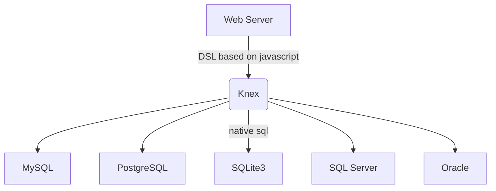

# Knex.js 教程

## 什么是 Knex ？

[Knex](https://github.com/knex/knex) 是一个流行的Node.js SQL查询构建器，它允许你使用JavaScript语言编写SQL查询，而无需直接编写SQL语句。它支持多种数据库，包括MySQL，PostgreSQL，SQLite和Microsoft SQL Server等。

使用Knex.js，你可以轻松地构建复杂的SQL查询，包括联接、子查询和聚合函数等。它还提供了一些方便的功能，如事务处理，批量插入和更新等。

Knex.js的API简单易用，具有良好的文档和社区支持。它还提供了可扩展性和灵活性，允许你轻松地自定义和扩展其功能。

下面是 Knex 的使用示例，使用 js 实现的 DSL 读写上与 SQL 非常相似。

import RunKitEmbed from '@site/src/components/RunKitEmbed';
import preamble from '!!raw-loader!./preamble'

<RunKitEmbed 
evaluateOnLoad
source={`
${preamble}
p(db.table('aa').select('b', 'c'))
`} />

<!--truncate-->

由于 Node.js 没有提供像 java 中的 JDBC 这样的数据库访问抽象层，导致基于原生的 Node.js 进行数据库编程时，需要面向不同的数据库类型提供的底层 SDK 编程，学习成本高、不可移植。

Knex 建立在底层数据库提供的 SDK 之上，提供统一的 API 数据库接口，可以将其看成是 Node.js 中类似"JDBC"的存在，代码与底层数据库耦合弱，方便在数据库之间迁移（如本地开发测试用 sqlite3，线上用MySQL），无需学习 SQL 方言。



## 优缺点及应用场景

优点：
- **简单易用**：Knex.js提供了一种简单而直观的API，使得构建和执行SQL查询变得非常容易。
- **跨数据库支持**：Knex.js支持多种数据库，包括MySQL、PostgreSQL、SQLite和Oracle等，使得开发人员可以轻松地在不同的数据库之间切换。
- **安全性**：Knex.js提供了一些安全功能，例如参数化查询和防止SQL注入攻击等，可以帮助开发人员保护应用程序免受安全漏洞的影响。
- **可测试性**：Knex.js的查询构建器可以轻松地进行单元测试，使得开发人员可以更轻松地测试其应用程序的查询逻辑。

缺点：
- **性能**：Knex.js的性能可能不如原生的SQL查询，因为它需要将查询构建器转换为SQL查询语句，这可能会导致一些性能损失。
- **学习曲线**：尽管Knex.js的API相对简单，但对于新手来说，学习如何使用它可能需要一些时间和努力。
- **限制**：Knex.js的查询构建器可能无法满足所有的查询需求，因为它是基于一组预定义的API构建的，而不是原生的SQL查询语句。

应用场景：
- Web应用程序：Knex.js可以用于构建Web应用程序的后端，以便与数据库进行交互。它可以帮助开发人员轻松地构建和执行SQL查询，从而简化了Web应用程序的开发过程。
- 数据分析：Knex.js可以用于数据分析应用程序，以便从数据库中检索和分析数据。它可以帮助开发人员轻松地构建复杂的查询，从而使数据分析变得更加容易。
- 数据库管理工具：Knex.js可以用于构建数据库管理工具，以便管理和维护数据库。它可以帮助开发人员轻松地执行数据库操作，例如创建表格、插入数据和更新数据等。
- 服务器端渲染：Knex.js可以用于服务器端渲染应用程序，以便从数据库中检索数据并将其呈现为HTML。它可以帮助开发人员轻松地构建复杂的查询，从而使服务器端渲染变得更加容易。

## 配置

### 连接池配置

在配置中设置合适的连接池有助于优化数据库性能，具体可以参考[pool](https://knexjs.org/guide/#pool)
```js
const knex = require('knex')({
  client: 'mysql',
  connection: {
    host: 'localhost',
    user: 'root',
    password: 'password',
    database: 'mydatabase'
  },
  // highlight-start
  pool: {
    min: 0,
    max: 10
  }
  // highlight-end
});
```

## 实战示例

### Schema Building

knex.js的 Schema Building 功能非常强大和灵活，使用它可以轻松构建和管理常见的数据库模式。

1. 创建表格：使用`createTable`方法可以创建新的数据库表格。
```js
knex.schema.createTable('users', (table) => {
  table.increments('id');
  table.string('name');
  table.string('email');
})
.then(() => {
  console.log('Table created');
})
.catch((err) => {
  console.error(err);
});
```

2. 修改表格：使用`alterTable`方法可以修改现有的数据库表格。

```js
knex.schema.alterTable('users', (table) => {
  table.string('password');
})
.then(() => {
  console.log('Table altered');
})
.catch((err) => {
  console.error(err);
});
```

3. 删除表格：使用`dropTable`方法可以删除现有的数据库表格。
```javascript
knex.schema.dropTable('users')
.then(() => {
  console.log('Table dropped');
})
.catch((err) => {
  console.error(err);
});
```

4. 添加列：使用`addColumn`方法可以向现有的数据库表格添加新列。
```javascript
knex.schema.table('users', (table) => {
  table.string('password');
})
.then(() => {
  console.log('Column added');
})
.catch((err) => {
  console.error(err);
});
```

5. 修改列：使用`alterColumn`方法可以修改现有的数据库表格列。
```javascript
knex.schema.table('users', (table) => {
  table.string('password').notNullable().defaultTo('');
})
.then(() => {
  console.log('Column altered');
})
.catch((err) => {
  console.error(err);
});
```

6. 添加索引：使用`index`方法可以向现有的数据库表格添加索引。
```javascript
knex.schema.table('users', (table) => {
  table.index('email');
})
.then(() => {
  console.log('Index added');
})
.catch((err) => {
  console.error(err);
});
```

7. 添加外键：使用`foreign`方法可以向现有的数据库表格添加外键。
```javascript
knex.schema.table('orders', (table) => {
  table.integer('user_id').unsigned().references('id').inTable('users');
})
.then(() => {
  console.log('Foreign key added');
})
.catch((err) => {
  console.error(err);
});
```

8. 修改外键：使用`dropForeign`和`foreign`方法可以修改现有的数据库表格外键。
```javascript
knex.schema.table('orders', (table) => {
  table.dropForeign('user_id');
  table.integer('customer_id').unsigned().references('id').inTable('customers');
})
.then(() => {
  console.log('Foreign key altered');
})
.catch((err) => {
  console.error(err);
});
```

9. 添加唯一约束：使用`unique`方法可以向现有的数据库表格添加唯一约束。
```javascript
knex.schema.table('users', (table) => {
  table.unique('email');
})
.then(() => {
  console.log('Unique constraint added');
})
.catch((err) => {
  console.error(err);
});
```

除了上述场景外，通过`raw`方法还可以实现数据库原生的一些模式，如MySQL中的视图、存储过程、触发器、序列等功能。

10. 创建视图：使用`raw`方法可以创建新的数据库视图。
```js
knex.raw('CREATE VIEW active_users AS SELECT * FROM users WHERE active = 1')
.then(() => {
  console.log('View created');
})
.catch((err) => {
  console.error(err);
});
```

### CRUD 增删改查

在这个示例中，我们使用MySQL作为数据库客户端，并连接到名为mydatabase的数据库。我们使用knex对象来执行CRUD操作。

首先，我们使用insert方法创建一个新用户。然后，我们使用select方法读取所有用户的数据。接下来，我们使用update方法更新ID为1的用户的名称。最后，我们使用del方法删除ID为1的用户。

```js
const knex = require('knex')({
  client: 'mysql',
  connection: {
    host: 'localhost',
    user: 'root',
    password: 'password',
    database: 'mydatabase'
  }
});

// Create
knex('users').insert({ name: 'John', email: 'john@example.com' })
  .then(() => {
    console.log('User created');
  })
  .catch((err) => {
    console.error(err);
  });

// Read
knex('users').select('*')
  .then((rows) => {
    console.log(rows);
  })
  .catch((err) => {
    console.error(err);
  });

// Update
knex('users').where({ id: 1 }).update({ name: 'Jane' })
  .then(() => {
    console.log('User updated');
  })
  .catch((err) => {
    console.error(err);
  });

// Delete
knex('users').where({ id: 1 }).del()
  .then(() => {
    console.log('User deleted');
  })
  .catch((err) => {
    console.error(err);
  });
```

### 分页查询

在Knex.js中实现分页查询可以使用`limit`和`offset`方法。`limit`方法用于限制查询结果的数量，`offset`方法用于指定查询结果的偏移量。以下是一个示例：

```js
const page = 2; // 第二页
const pageSize = 10; // 每页10条记录

knex('users')
  .select('*')
  // highlight-start
  .limit(pageSize)
  .offset((page - 1) * pageSize)
  // highlight-end
  .then((rows) => {
    console.log(rows);
  })
  .catch((err) => {
    console.error(err);
  });
```

在上面的示例中，我们使用`limit`方法限制查询结果的数量为10条记录，使用`offset`方法指定查询结果的偏移量为10条记录（即第二页）。这将返回第11到第20条记录。

如果您希望在查询中添加其他条件，例如按名称排序，则可以在select方法之后添加orderBy方法：
```js
const page = 2; // 第二页
const pageSize = 10; // 每页10条记录

knex('users')
  .select('*')
  // highlight-start
  .orderBy('name', 'asc')
  .limit(pageSize)
  .offset((page - 1) * pageSize)
  // highlight-end
  .then((rows) => {
    console.log(rows);
  })
  .catch((err) => {
    console.error(err);
  });
```

### 批量插入

使用batchInsert方法可以一次性插入多个记录
```js
knex.batchInsert('users', [
  { name: 'John', email: 'john@example.com' },
  { name: 'Jane', email: 'jane@example.com' },
  { name: 'Bob', email: 'bob@example.com' }
])
.then(() => {
  console.log('Batch insert complete');
})
.catch((err) => {
  console.error(err);
});
```

### 联结查询

在Knex.js中实现联结查询可以使用 [join](https://knexjs.org/guide/query-builder.html#join-methods) 方法。`join`方法用于将两个或多个表格联结在一起，以便在查询中使用它们的列。以下是一个示例：

```js
knex('users').join('accounts', 'users.id', '=', 'accounts.user_id')
  .select('users.name', 'accounts.balance')
  .then((rows) => {
    console.log(rows);
  })
  .catch((err) => {
    console.error(err);
  });
```

在上面的示例中，我们使用`join`方法将users表格和orders表格联结在一起，以便在查询中使用它们的列。我们使用select方法选择users.name和orders.order_number列。这将返回一个包含用户名称和订单号的结果集。

如果您需要使用不同类型的联结（不同联结类型的区别参考[SQL Joins](https://www.w3schools.com/sql/sql_join.asp)），例如左联结或右联结，则可以在`join`方法之前添加`leftJoin`或`rightJoin`方法：

```js
knex('users')
  .leftJoin('orders', 'users.id', '=', 'orders.user_id')
  .select('users.name', 'orders.order_number')
  .then((rows) => {
    console.log(rows);
  })
  .catch((err) => {
    console.error(err);
  });
```

在上面的示例中，我们使用leftJoin方法执行左联结。这将返回一个包含所有用户和他们的订单（如果有）的结果集。

### 事务处理

使用transaction方法可以在一个事务中执行多个查询，并确保它们都成功或都失败。

```js
knex.transaction((trx) => {
  knex('users').transacting(trx).insert({ name: 'John', email: 'john@example.com' })
    .then(() => {
      return knex('accounts').transacting(trx).insert({ user_id: 1, balance: 100 });
    })
    .then(trx.commit)
    .catch(trx.rollback);
})
.then(() => {
  console.log('Transaction complete');
})
.catch((err) => {
  console.error(err);
});
```


### Raw Query

使用raw方法可以执行原始的SQL查询。

```js
knex.raw('SELECT * FROM users WHERE name = ?', ['John'])
  .then((rows) => {
    console.log(rows);
  })
  .catch((err) => {
    console.error(err);
  });
```


## 总结