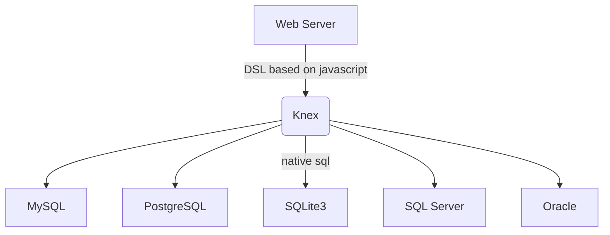

# Knex.js 教程

## 什么是 Knex ？

[Knex](https://github.com/knex/knex) 是一个使用 javascript 实现的跨数据库的 SQL Query Builder，基于 javascript 实现了一套灵活、可移植、易于使用 SQL DSL，支持的数据库有 PostgreSQL, MySQL, CockroachDB, SQL Server, SQLite3 和 Oracle，支持事务、数据迁移等，同时支持 Node.js 和浏览器。

下面是 Knex 的使用示例，使用 js 实现的 DSL 读写上与 SQL 非常相似。

import RunKitEmbed from '@site/src/components/RunKitEmbed';
import preamble from '!!raw-loader!./preamble'

<RunKitEmbed 
evaluateOnLoad
source={`
${preamble}
p(db.table('aa').select('b', 'c'))
`} />

## 优点及应用场景

由于 Node.js 没有提供像 java 中的 JDBC 这样的数据库访问抽象层，导致基于原生的 Node.js 进行数据库编程时，需要面向不同的数据库类型提供的底层 SDK 编程，学习成本高、不可移植。

Knex 建立在底层数据库提供的 SDK 之上，提供统一的 API 数据库接口，可以将其看成是 Node.js 中类似"JDBC"的存在，代码与底层数据库耦合弱，方便在数据库之间迁移（如本地开发测试用 sqlite3，线上用MySQL），无需学习 SQL 方言。

## CRUD 示例

下面示例演示基于 Knex 实现常见的 CRUD 操作，执行结果通过最终生成的 SQL 表示。

### 定义表结构

<RunKitEmbed 
source={`
p(db.schema.createTable('users', function (table) {
  table.increments('id');
  table.string('name');
  table.integer('age');
  table.timestamps('create_at');
}))
`} 
preamble={preamble}
/>

### Create 插入

<RunKitEmbed 
source={`
p(db.table('users').insert({name: 'whincwu', age: 32}))
`} 
preamble={preamble}
/>

### Read 查询

<RunKitEmbed 
source={`
// 查询全部列
p(db.select().from('users'))
// 查询部分列 + 筛选条件 + 排序
p(db.select(['name', 'age'])
    .from('users')
    .where('name', 'whincwu').andWhere('age', '>', 18)
    .orderBy('age', 'desc')
)
// 模糊查询
p(db.select(['name', 'age'])
    .from('users')
    .whereLike('name', 'w%')
)
`} 
preamble={preamble}
/>

### Update 更新

<RunKitEmbed 
source={`
// 按条件更新
p(db.table('users').update({age: 33}).where('name', 'whincwu'))
`} 
preamble={preamble}
/>

### Delete 删除

<RunKitEmbed 
source={`
// 按条件删除
p(db.table('users').delete().where('id', '1'))
`} 
preamble={preamble}
/>

### 分页查询

<RunKitEmbed 
source={`
p(db.select('*').from('users').limit(10).offset(30))
`} 
preamble={preamble}
/>

### 连表查询

<RunKitEmbed 
source={`p(db.table('users')
  .join('contacts', 'users.id', '=', 'contacts.user_id')
  .select('users.id', 'contacts.phone'));
// 多个 join 条件
p(db.select('*').from('users').join('accounts', function() {
  this
    .on('accounts.id', '=', 'users.account_id')
    .orOn('accounts.owner_id', '=', 'users.id')
}));`} 
preamble={preamble}
/>

### 事务

<RunKitEmbed 
readOnly
source={`db.transaction(function(trx) {
  const books = [
    {title: 'Canterbury Tales'},
    {title: 'Moby Dick'},
    {title: 'Hamlet'}
  ];
  return trx
    .insert({name: 'Old Books'}, 'id')
    .into('catalogues')
    .then(function(ids) {
      books.forEach((book) => book.catalogue_id = ids[0]);
      return trx('books').insert(books);
    })
})
.then(function(inserts) {
    // 事务执行成功
    console.log(inserts.length + ' new books saved.');
})
.catch(function(error) {
    // 事务执行失败，自动回滚
    // If we get here, that means that 
    // neither the 'Old Books' catalogues insert,
    // nor any of the books inserts will have taken place.
    console.error(error);
});
`} 
preamble={preamble}
/>

## 数据迁移

### 种子数据

## 总结