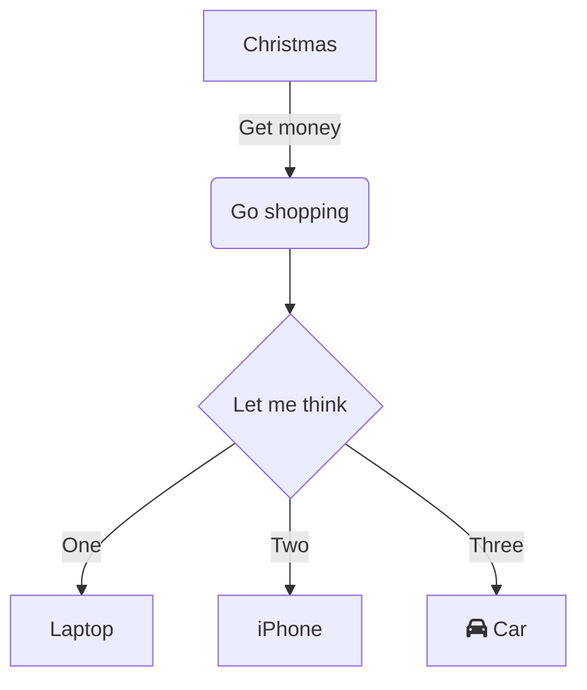

# Knex - SQL Query Builder

## 什么是 Knex ？

[Knex](https://github.com/knex/knex) 是一个 SQL 的 Query Builder，基于 Node.js 实现，支持 PostgreSQL, MySQL, CockroachDB, SQL Server, SQLite3 和 Oracle，被设计成灵活、可移植、易于使用。

下面是 Knex 的使用示例，首先创建 Knex 实例，然后执行 SQL 查询。

import RunKitEmbed from '@site/src/components/RunKitEmbed';

<RunKitEmbed source={`
    const knex = require('knex');
    const db = knex({client: 'mysql'});
    await db.table('aa').select('b', 'c').toSQL().toNative()
`} />

## 应用场景

Node.js 没有提供像 JDBC 这样的数据库访问抽象层，导致基于原生的 Node.js 进行数据库编程时，需要面向不同的数据库类型提供的底层 SDK，优点是可以充分利用目标数据库的能力，缺点是需要学习特定数据库的方言、代码不具备可移植性。

Knex 建立在这些底层的数据库访问 SDK 之上，抽象除了统一的 API 接口访问底层数据库，其 API 设计成内部 DSL 风格，灵活且易于阅读。

## CRUD 示例

## 数据迁移

## 种子数据